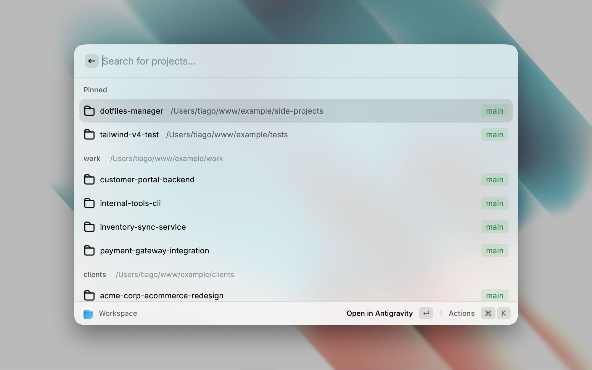
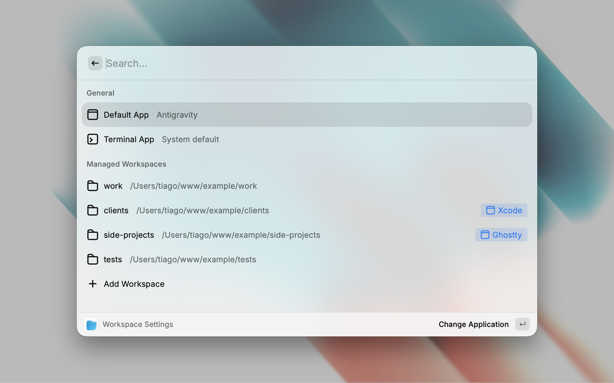

  

# Workspace

Manage and access all your projects and folders from one place.

Workspace is a [Vicinae](https://vicinae.com) extension that gives you a central hub for all your projects across multiple directories.

> [!TIP]
> **Not just for developers!** Perfect for code, design assets, writing, or any folder-based workflows.

## Installation

This extension targets [Vicinae](https://docs.vicinae.com/) on Linux and macOS.

To install and run it from source:

1. Install and start [Vicinae](https://docs.vicinae.com/).
2. Clone this repository.
3. Run `npm install`.
4. Run `npm run dev` while Vicinae is running, or `npm run build` to install a production build.

See the [Vicinae extension docs](https://docs.vicinae.com/extensions/create) for more detail.

## Key Features

- Blazing-fast fzf-style fuzzy search
- Unified list of all projects from your configured workspace folders
- Instant open in your default (or per-workspace) application
- **Grid and List Views**: Toggle between Grid and List views seamlessly.
- **Recent Projects**: Automatically tracks your most recently opened projects.
- **Import/Export Settings**: Backup and restore all your workspaces, pins, and configurations to a single JSON file.
- Git status: current branch + pending changes
- Pin favorite projects
- Add, remove, and reorder workspace folders

## Screenshots

> Main Workspace command with pinned projects, Git status, and fast search.

> Adding, removing, and reordering workspace folders + per-workspace app overrides.

## Getting Started

1. Run **Manage Workspaces** to add your project root folders.
2. Configure your default application and preferred view mode in **Workspace Settings**.
3. Use the **Workspace** command to search and open projects instantly.
4. Export your settings to keep a backup of your workspaces and pinned projects.

## Commands

- **Workspace** – Search and open projects
- **Manage Workspaces** – Add/remove/reorder workspace folders
- **Workspace Settings** – Apps, View Mode, and Backup/Restore settings

## Creator's Note

Pin the `Workspace` command in Vicinae for the fastest loop: open the launcher, jump to Workspace, type a project name or pick a pinned one.

## Contributing

Contributions welcome! Open an issue or submit a pull request on GitHub.
